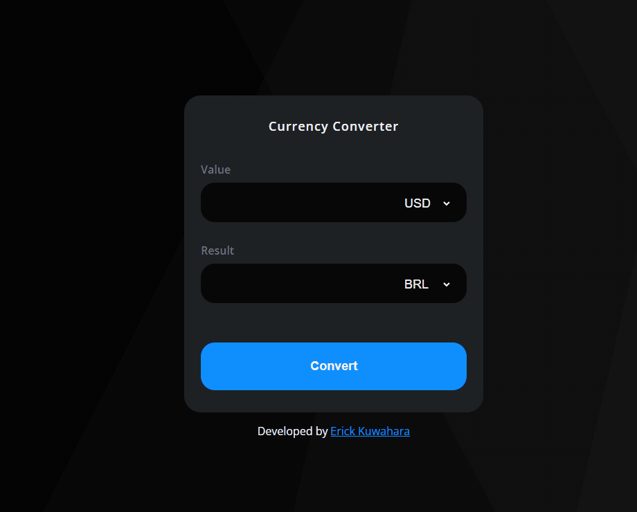

    <h2>⚜️ C U R R E N C Y &nbsp;&nbsp; C O N V E R T E R ⚜️</h2>

    <a href="#-project">Project</a>&nbsp;&nbsp;&nbsp;|&nbsp;&nbsp;&nbsp;
    <a href="#-technologies">Technologies</a>&nbsp;&nbsp;&nbsp;|&nbsp;&nbsp;&nbsp;
    <a href="#-features">Features</a>

 

<h3 align="center">
    
     
    <a href="https://erickks.github.io/currency-converter-app/">live demo</a>
</h3>

 

## 📚 Project

I developed this project to practice my manipulation of data from an API.

I know the design of this project is a little ugly, but I promise that one day, I will make it more elegant.

 

## 🖥 Technologies
  * [Html](https://www.w3schools.com/html/)
  * [Css](https://www.w3schools.com/css/)
  * [Javascript](https://www.javascripttutorial.net/)
  * [Frankfurter API](https://www.frankfurter.app/)

 

## 🧾 Features
- [x] Get the value entered by the user
- [x] Fetch currency data within the API
- [x] Show the data obtained from the API
- [x] This app has 32 currencies that can be converted
